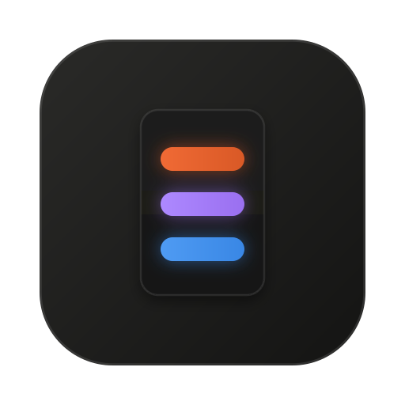

<p align="center"></p>

<h1 align="center">CODE DECK</h1>

<p align="center">
  A desk dashboard for your AI coding agents, on a tiny USB screen.<br>
  Live <b>Claude Code</b>, <b>Claude Max</b> and <b>Codex</b> usage on a <b>TURZX 3.5" smart screen</b>,<br>
  a banner the moment an agent is waiting on you, and a drag-and-drop layout builder.
</p>

<p align="center">
  
  &nbsp;&nbsp;
  
</p>

<p align="center"><sub>Screenshots use the built-in sample data (<code>--mock</code>); the project names are invented.</sub></p>

---

## What it does

You run several agent sessions at once. CODE DECK puts all of them on a small
screen next to your keyboard, so you can see at a glance:

- **What you're spending.** Today's Claude Code spend, taken from Claude
  Code's own telemetry, with a 24-hour activity sparkline. It turns red past a
  daily budget you set.
- **How much quota is left.** Claude Max and Codex weekly usage, yellow at 75%
  and red at 80%.
- **Which agents need you.** One row per session, named after its project
  folder. Green means it's working, blue means it's waiting on you: a
  permission prompt, a question, or a finished turn.
- **When to look up.** A full-screen **NEEDS YOU** banner plays when a session
  blocks on a permission prompt or question.
- **Anything else you add.** CPU, memory, disk and network tiles, clocks, text
  and dividers. Every element is a widget you can move, resize or remove.

It runs locally and reads only files already on your machine: Claude Code's
transcripts, Codex's session files, and telemetry Claude Code sends to
`127.0.0.1`. Nothing is uploaded anywhere.

## The hardware: TURZX 3.5" smart screen

TURZX makes small USB "smart screens" meant for showing PC stats such as
temperatures. The 3.5" model is a 320x480 portrait display that needs only a
USB cable. The vendor's software, `UsbMonitor.exe`, is Windows-only.

CODE DECK replaces that software on **macOS and Linux**. It drives the screen
directly and uses it as a general-purpose display for the dashboard.

**Tested device:** USB ID `1a86:5722`, serial string `USB35INCHIPSV2`,
320x480 portrait. Other TURZX sizes likely use the same protocol with a
different resolution, but they are untested. Run `code-deck init` and the
wizard will tell you whether your screen is detected.

### How the screen is driven

The screen enumerates as a USB serial (CDC) device, so the obvious approach
is to write to `/dev/cu.usbmodem*`. On macOS that corrupts frames: the serial
driver drops bytes under sustained writes and the image shears. CODE DECK
talks to the USB bulk endpoint directly through libusb instead, which is what
the Windows driver effectively does.

| | |
|---|---|
| Transport | libusb bulk OUT on endpoint `0x03`, interface 1; no sudo needed on macOS |
| Startup | the vendor's exact power-on sequence (`FF`, brightness, `6D`, `7A`, `79` portrait 320x480), replayed from USB captures |
| Drawing | a 6-byte rectangle command (`x0 y0 x1 y1`, command `0xC5`) followed by raw RGB565 little-endian pixels |
| Partial updates | any rectangle can be redrawn on its own, so a ticking clock digit costs about 10 ms instead of a full frame |
| Safety | any pixel whose bytes would collide with a protocol command code is remapped to the nearest identical-looking safe colour, so a byte slip can't blank or reset the panel |
| Speed | about 1.9 s per full frame; this is the panel's USB limit, not the software's |

The full reverse-engineering record, with USB captures, decoded frames and
analysis, is in [`docs/protocol/`](docs/protocol/turzx_protocol_report.md).
The vendor's Windows software is **not** included in this repository.

CODE DECK is an independent project and is not affiliated with TURZX.

## Quick start (macOS)

You need Python 3.11+, Node 20+ with pnpm, pipx (or uv), and
[Homebrew](https://brew.sh) for libusb.

```sh
git clone https://github.com/ehfazrezwan/code-deck.git
cd code-deck
./install.sh
```

`install.sh` checks prerequisites, builds the web app, installs the
`code-deck` command with pipx, and then starts the **setup wizard**. Run
`./install.sh --check` first if you only want to see what's missing.

### The setup wizard

`code-deck init` walks you through everything, one step at a time. Every step
can be skipped, and it is safe to re-run.

1. **libusb.** Finds it, or offers to install it with Homebrew.
2. **The screen.** Detects the TURZX panel, waits while you plug it in, and
   shows a test frame so you can see the connection works.
3. **Renderer.** Installs the headless Chromium that draws the dashboard, a
   one-time download.
4. **Ports.** Checks that 8765 and 4318 are free and picks others if not.
5. **Claude Code.** Checks whether the hooks and telemetry are set up, and if
   not, shows the exact block to paste into `~/.claude/settings.json`. It can
   copy it to your clipboard. CODE DECK never edits that file itself.
6. **Codex.** Detects it; it's optional.
7. **Settings.** Saves your choices to `~/.config/code-deck/.env`.
8. **Service.** Installs a launchd agent so the dashboard starts at login and
   restarts if it crashes, then opens the builder.

`code-deck init --yes` accepts every default without prompting.
`code-deck doctor` re-checks the whole setup at any time.

### Connecting Claude Code

Two pieces make the dashboard fully live. The wizard shows both, and you can
print them any time:

```sh
code-deck hooks print   # needs-you / turn-ended status for each session
code-deck env print     # authoritative spend via Claude Code's telemetry
```

Merge the output into `~/.claude/settings.json`. Until telemetry is enabled,
spend is estimated from token counts and marked `est`. Only sessions started
after the change report telemetry.

## Configuration

All settings are optional `CODE_DECK_*` variables, documented in
[`.env.example`](.env.example). They are read in this order, with the first
value found winning:

1. the real environment, e.g. `CODE_DECK_PORT=9000 code-deck serve`
2. a file named by `CODE_DECK_ENV_FILE`
3. `./.env` in the current folder, for a repo checkout or Docker
4. `~/.config/code-deck/.env`, which the wizard writes and which the
   background service and menu bar app read

| Variable | Default | What it does |
|---|---|---|
| `CODE_DECK_PORT` | `8765` | Builder, API and player port |
| `CODE_DECK_HOST` | `127.0.0.1` | `0.0.0.0` exposes the builder on your LAN |
| `CODE_DECK_OTLP_PORT` | `4318` | Where Claude Code sends telemetry |
| `CODE_DECK_RENDERER` | `chromium` | `pil` is the legacy renderer; `none` serves the API only |
| `CODE_DECK_CLAUDE_DIR` | `~/.claude` | Claude Code's data folder |
| `CODE_DECK_CODEX_DIR` | `~/.codex` | Codex's data folder |
| `CODE_DECK_LIBUSB` | auto | Path to libusb if it isn't found automatically |

`.env.example` lists the rest. Only `CODE_DECK_*` keys are loaded, so an
unrelated `.env` in a project folder is never picked up. Nothing secret
belongs in these files: CODE DECK needs no API keys or tokens.

## The layout builder

Open `http://127.0.0.1:8765/`. The canvas is a 1:1 render of the screen,
because the builder and the device use the same React components.

- Drag widgets from the library onto the screen, then move and resize them on
  an 8 px grid.
- Edit each widget's properties in the inspector.
- Undo and redo freely, then **Save** to push the layout to the device. Turn
  on **live** to push every change as you make it.
- **Settings** holds brightness, which applies instantly, plus the banner
  behaviour and refresh rate.

`/player` is the raw device view and `/preview` is a read-only frame.

## Menu bar app (macOS)

A small native app shows the same dashboard in your menu bar.

- The status item reads `$spend · codex%`. A blue dot means a session is
  waiting on you.
- **Click** pins the live dashboard open; **hover** peeks at it.
- **⌥⇧D** toggles it as a floating window, useful when the menu bar is full.
- It posts **macOS notifications** when a session's turn ends or it needs you.
  Each one names the project folder.
- Right-click for the builder, popover size, notification options and
  launch-at-login.

```sh
./menubar/build.sh --install     # Xcode Command Line Tools are enough
```

If notifications don't appear, check that no Focus mode is silencing them.
The app's right-click menu links straight to the right settings pages.

## How it works

```
Claude Code / Codex files, telemetry, hooks ─▶ providers ─▶ state store ─▶ WebSocket
                                                                      │
          builder  ◀── same React widgets ──▶  /player  ◀─────────────┘
                                                  │ headless Chromium
                                                  ▼ screenshot when something changed
                                       diff against the last frame ─▶ USB: just that rectangle
```

- A Python server (FastAPI) tails Claude Code transcripts and Codex session
  files, receives Claude Code's telemetry, and listens to its hooks.
- The dashboard is a React app. A headless Chromium renders it at exactly
  320x480, and takes a screenshot only when the page reports a change.
- Each new frame is diffed against the last one, and only the changed
  rectangle is sent over USB. A ticking seconds digit is a 5x7 px update of
  about 10 ms.
- Fonts are bundled (Inter and JetBrains Mono, both OFL), so frames look the
  same on macOS and Linux.

## Linux and Raspberry Pi (Docker)

macOS can't pass USB devices into containers, so the Mac install is native.
On Linux:

```sh
cp .env.example .env     # optional
docker compose --env-file .env -f docker/compose.yml up -d --build
```

The container gets `/dev/bus/usb`, read-only access to your Claude Code
projects and Codex folder, and read-write access to `~/.claude/code-deck` for
session status and cost state. It publishes the builder and the telemetry
port on localhost. Point Claude Code's telemetry and hooks at it exactly as
on macOS.

You can also skip Docker: `./install.sh` works on Linux, then run
`code-deck serve` under systemd or similar. You may need a udev rule for USB
ID `1a86:5722`.

## Development

```sh
cd server && uv sync --group dev && uv run pytest && uv run ruff check src tests
cd web && pnpm install && pnpm typecheck && pnpm test
cd web && pnpm build:server                   # builds into server/src/code_deck/static
uv run code-deck serve --no-device --mock     # no hardware: renders to preview.png
uv run code-deck render out.png --mock        # one frame, no device
```

For hot reload on the physical screen, run `pnpm dev` in `web/`, then
`code-deck serve --player-url http://127.0.0.1:5173/player?device=1`.

A new widget is one React file. See [CONTRIBUTING.md](CONTRIBUTING.md).

## Troubleshooting

Start with `code-deck doctor`.

| Symptom | Fix |
|---|---|
| `libusb not found` | `brew install libusb` or `apt install libusb-1.0-0`, or set `CODE_DECK_LIBUSB` |
| Screen present but nothing drawn | Close anything holding `/dev/cu.usbmodem*`, such as a serial monitor, then unplug and replug. The service reconnects on its own. |
| Screen not detected | Use a data-capable USB cable; many charge-only cables fit the port. On Linux, check udev permissions. |
| Spend shows `est` | Paste `code-deck env print` into settings.json. Only sessions started afterwards report telemetry. |
| No needs-you / turn-ended status | Paste `code-deck hooks print`. `doctor` flags a stale hook path. |
| Port already in use | Re-run `code-deck init`, or set `CODE_DECK_PORT` in `~/.config/code-deck/.env` |
| Service not running | `code-deck service logs` |

## License

MIT. See [LICENSE](LICENSE).
