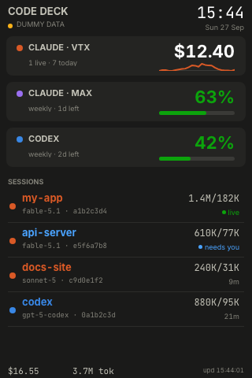
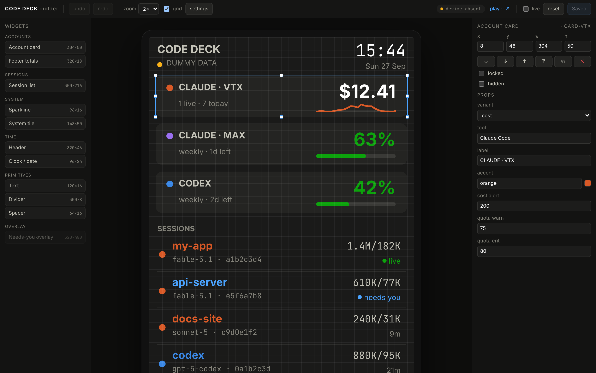

# CODE DECK

A desk dashboard for a **TURZX 3.5" USB smart screen** (320x480 portrait) that
shows live **Claude Code**, **Claude Max** and **Codex** usage — spend, weekly
quota, active sessions — and flashes **NEEDS YOU** when an agent is waiting on
you. Lay the screen out yourself in a drag-and-drop builder that is a 1:1
render of the device.

<p align="center">
  
  &nbsp;&nbsp;
  
</p>

## What it shows

- **Claude Code on Vertex** — today's spend (authoritative, from Claude Code's
  own OTLP telemetry; estimated from tokens until that's enabled), sessions,
  a 24 h sparkline. Red past a daily budget you set.
- **Claude Max / Codex** — weekly quota %, red ≥ 80, yellow ≥ 75.
- **Sessions** — one row per recent agent session, named after its working
  directory, coloured by tool: green *live*, blue **needs you** (permission
  prompt or question) or **turn ended**, else idle age.
- **NEEDS YOU** — a full-screen banner the moment a session blocks on you.
- **System** — CPU, memory, disk, network tiles; clocks; text and dividers.

Everything is a widget. The builder's palette is the component library, and
it grows: a new widget is one React file (see `CONTRIBUTING.md`).

## Install (macOS)

```
brew install libusb
pipx install ./server        # or the wheel from server/dist / PyPI
code-deck setup              # one-time: headless Chromium for the renderer
code-deck doctor             # libusb, device, hooks, telemetry, service
code-deck service install    # launchd agent: starts at login, restarts on crash
open http://127.0.0.1:8765   # the builder
```

Claude Code integration — both blocks are printed for **you** to paste into
`~/.claude/settings.json`; this tool never writes that file:

- `code-deck env print` — telemetry env so Claude Code exports authoritative
  cost to the built-in OTLP receiver on `127.0.0.1:4318`.
- `code-deck hooks print` — registers `code-deck-hook` on `Notification`,
  `Stop`, `UserPromptSubmit`, `SessionEnd` for the needs-you / turn-ended
  session status.

Codex quota is read from the Codex app-server (`~/.codex/plugins/…`); if it's
absent it falls back to the rollout files. Logs live in
`~/Library/Logs/code-deck/`; the last frame is mirrored to
`~/.config/code-deck/preview.png`; `code-deck serve` runs in the foreground.

## The builder

`http://127.0.0.1:8765/` — drag widgets from the palette onto the device
frame, move and resize them on an 8 px grid, edit props in the inspector
(generated from each widget's schema), undo/redo, then **Save · push to
device**. Turn on **live** to push every change as you make it. Settings
holds brightness (applied instantly), the needs-you banner and refresh rate.
`/player` is the raw device view; `/preview` a read-only frame.

## How it works

```
Claude Code / Codex files, OTLP, hooks ─▶ providers ─▶ StateStore ─▶ WS /ws/state
                                                                     │
        builder  ◀── same React widgets ──▶  /player  ◀──────────────┘
                                                │ headless Chromium
                                                ▼ screenshot when dirty
                                     diff vs last frame ─▶ UsbRaw.draw(rect)
```

- The React player marks itself dirty on every change (data, clock, layout,
  overlay animation). Python polls that counter, screenshots only then, diffs
  against the previous frame and pushes just the changed rectangle over USB.
  A ticking seconds digit is a 5x7 px push (~8 ms); a full frame is ~1.9 s,
  the panel's transport limit — anything changing most of the screen is
  capped around 0.5 fps by physics, not software.
- Fonts are bundled Inter + JetBrains Mono (OFL), so frames are identical on
  macOS and Linux.
- `--renderer pil` keeps the original PIL renderer as a fallback for one
  release.

### Why raw USB

The screen enumerates as a CDC serial device, but the macOS serial driver
corrupts frames. Driving the bulk endpoint directly with libusb is what
works — see `docs/protocol/turzx_protocol_report.md` for the captures and the
protocol. The vendor's Windows software is **not** part of this repository.

## Linux / Raspberry Pi (Docker)

macOS can't pass USB into containers, so the Mac install is native. On Linux:

```
docker compose -f docker/compose.yml up -d --build
```

The container gets `/dev/bus/usb`, read-only `~/.claude/projects` and
`~/.codex`, read-write `~/.claude/code-deck` (attention flags, cost state),
and publishes `8765` (builder) and `4318` (OTLP) on localhost. Point Claude
Code's telemetry and hooks at it exactly as on macOS.

## Development

```
cd server && uv sync --group dev && uv run pytest && uv run ruff check src tests
cd web && pnpm install && pnpm typecheck && pnpm test
cd web && pnpm build:server            # builds into server/src/code_deck/static
uv run code-deck serve --no-device --mock   # no hardware: renders to preview.png
uv run code-deck render out.png --mock      # one frame, no device (CI golden)
```

Hot reload on the device: `pnpm dev` in `web/`, then
`code-deck serve --player-url http://127.0.0.1:5173/player?device=1`.
Ship a build into the installed service:
`cd server && uv build && UV_VENV_CLEAR=1 pipx install --force dist/*.whl && code-deck service install`.

## Troubleshooting

`code-deck doctor` is the first stop. Common ones:

| Symptom | Fix |
|---|---|
| `libusb not found` | `brew install libusb` (macOS) / `apt install libusb-1.0-0`, or set `CODE_DECK_LIBUSB` |
| device present but nothing drawn | close anything holding `/dev/cu.usbmodem*`; unplug/replug — the service reconnects on its own |
| `$` shows `est` | paste `code-deck env print` into settings.json; only sessions started afterwards export cost |
| no needs-you / turn-ended | paste `code-deck hooks print`; `doctor` flags a stale hook path |
| service not running | `code-deck service logs` |

## License

MIT — see `LICENSE`.
